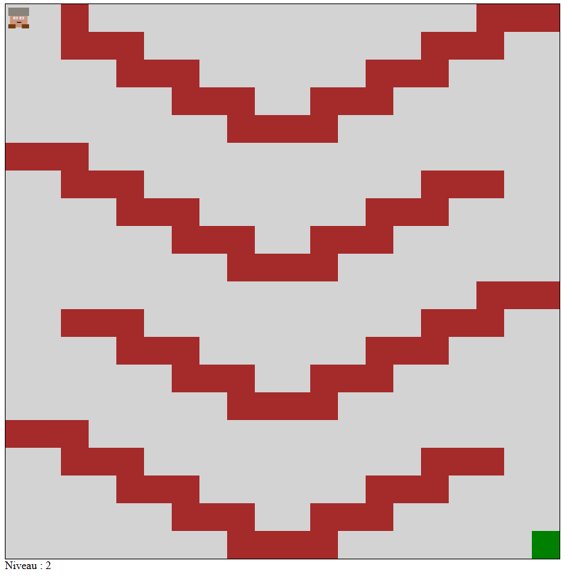
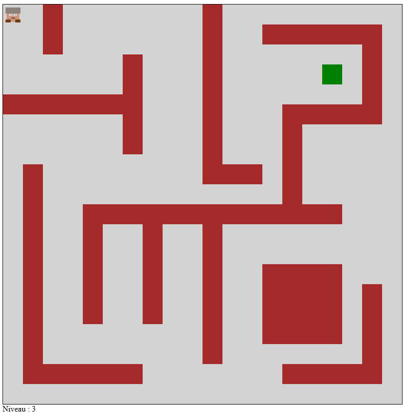

# L3Miage2024_2025_IntroJS

Fait par Romain STEFANI

Petit jeu fait dans le canvas.

L'objectif est de déplacer le joueur et d'atteindre le carré vert sans toucher les obstacles.

On peut déplacer le joueur avec les touches : 
    - z ou fleche du haut (aller vers le haut)
    - q ou fleche du gauche (aller vers le gauche)
    - s ou fleche du bas (aller vers le bas)
    - d ou fleche du droite (aller vers le droite)

Quand on touche un obstacle, on doit recommencer le niveau.

Atteindre le carré vert lance directement le niveau suivant.

3 niveaux de difficulté progressive.

Possibilité d'évolution : 

    - objet pour changer sa taille ou sa vitesse
    - obstacle mouvant

Exemple de niveau : 

Niveau 2 :

Niveau 3 :
